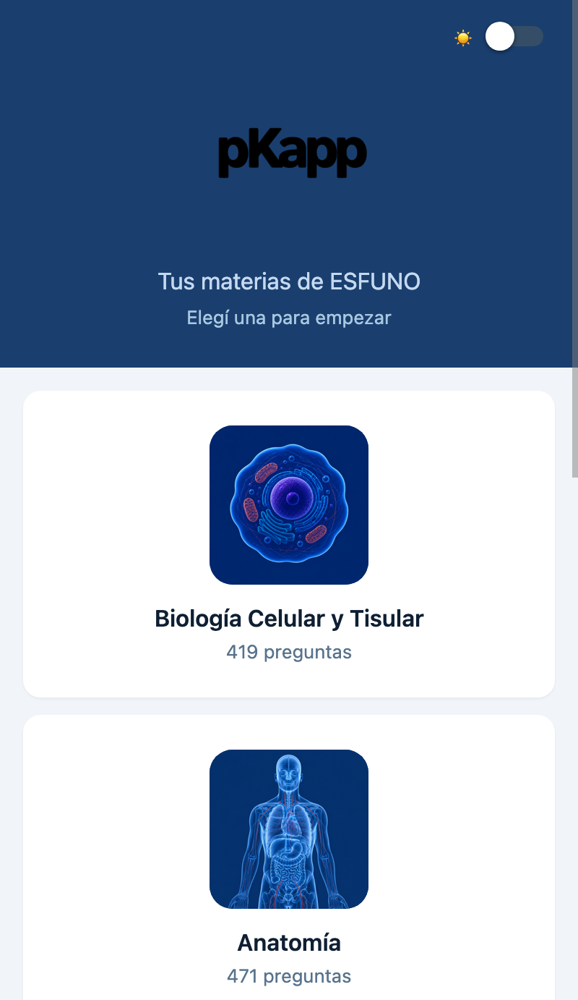
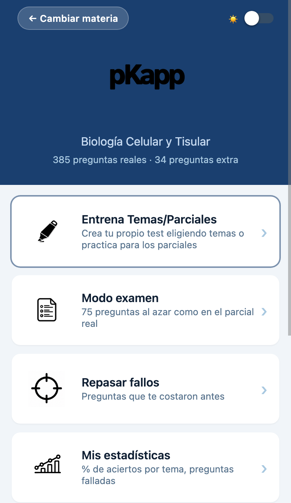
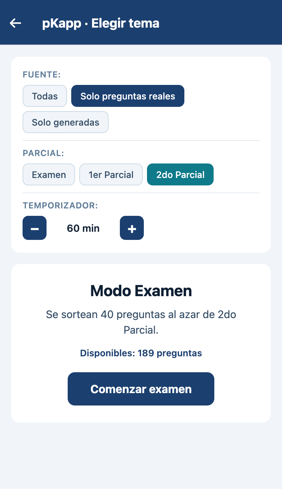
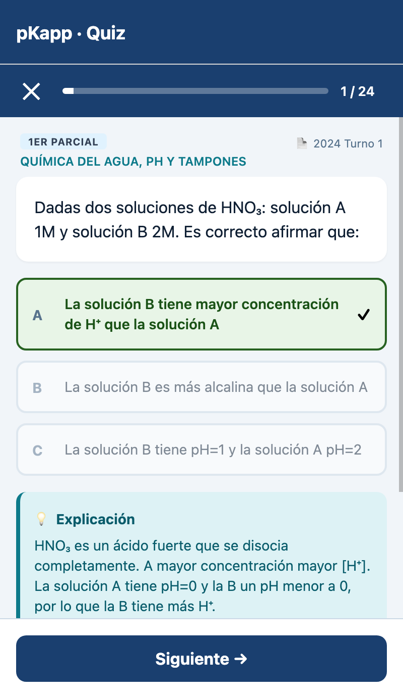
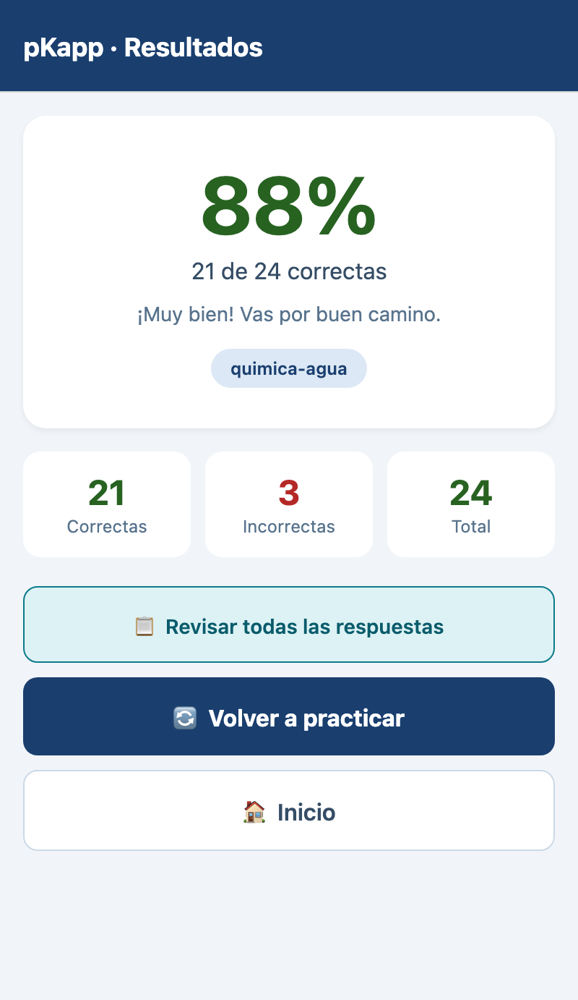
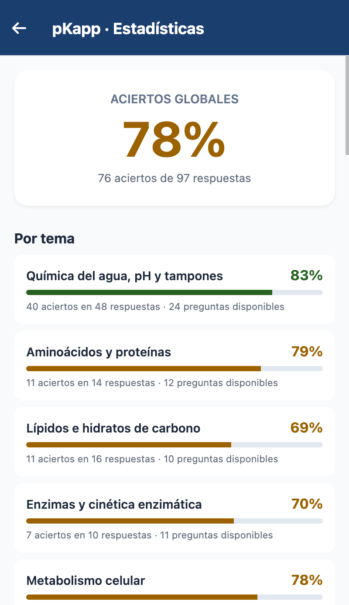

# pKapp · versión web

[pkapp.uy](https://pkapp.uy)

pKapp nació para acompañar a mi pareja en el estudio y terminó siendo útil para más personas. La idea era simple: resolver una necesidad concreta de preparación con preguntas reales, explicaciones claras y un flujo de repaso que no perdiera contexto.

La versión web mantiene esa intención, pero pensada para funcionar en navegador y sentirse como una app: accesible, portable y útil en la vida cotidiana. No se construyó para parecer algo grande desde el principio; se construyó para resolver un problema real y seguir creciendo sin perder claridad.

La forma de trabajar en este proyecto está guiada por un enfoque de **Spec Driven Development**: cada cambio nace de una necesidad, se define con intención y se implementa con criterio. La prioridad no es sumar funciones por sumar; es mantener una base útil, coherente y fácil de sostener.

> Es gratis, y va a serlo mientras pueda mantenerla.

Construido con **Expo / React Native**. Esta es la **versión web** del proyecto: corre en cualquier navegador moderno y se puede instalar como **PWA** (Progressive Web App) en escritorio, Android e iOS.

> Si buscás la versión nativa (iOS / Android), está en [pKapp](https://github.com/agustinfrusto/pKapp).

## Capturas

<p align="center">
  
  
  
</p>
<p align="center">
  
  
  
</p>

## Qué hace pKapp

pKapp está pensado para estudiar de forma práctica y enfocada. La app ayuda a repasar materias del plan de la Escuela Técnica de Medicina —BCYT, Anatomía, Neurobiología y Cardiovascular y Respiratorio— con un banco de preguntas estructurado, explicaciones útiles y seguimiento del desempeño.

## Características

- **Multimateria** (ESFUNO): hoy con **Biología Celular y Tisular** (BCYT), **Anatomía**, **Neurobiología** y **Cardiovascular y Respiratorio** (CyR). Estructura preparada para sumar los demás módulos.
- **Banco de preguntas** con material real y generado, según la materia: BCYT, Anatomía, Neurobiología y CyR.
- **1049 preguntas reales** extraídas de parciales y exámenes oficiales (BCYT 2022/2024/2025 + Anatomía 2018-2025 + Neurobiología + CyR según el banco disponible).
- **34 preguntas adicionales** generadas con Claude a partir de los apuntes (solo BCYT).
- **Filtros:** por fuente (examen real / generada) y por parcial, combinables.
- **Tres modos:**
  - **Práctica por tema:** elegís un tema específico o practicás por parcial.
  - **Examen:** preguntas al azar con tamaño igual al examen real (configurable por materia — BCYT: 75 / 40 por parcial; Anatomía: 50 / 25 por parcial; Neurobiología: 25, sin parciales; CyR: 50, sin parciales).
  - **Repaso de fallos:** las que respondiste mal antes.
- **Explicaciones** tras cada respuesta o al final del cuestionario.
- **Estadísticas** por tema y lista de preguntas más falladas.
- **Agregar tus propias preguntas** al banco (se guardan localmente).
- **Timer** opcional para poner un tiempo a los cuestionarios (hasta dos horas).
- **PWA instalable** en cualquier dispositivo, con ícono propio y experiencia tipo app.

## Cómo se construye pKapp

Este proyecto no se construye como una lista interminable de features. La idea es simple: cada cambio parte de una necesidad real y se define antes de implementarse.

### Principios

- Cada funcionalidad nace de un problema concreto.
- Antes de construir, se define el comportamiento esperado.
- Se validan decisiones de UX, arquitectura y contenido.
- La documentación acompaña la implementación, en vez de quedar como deuda posterior.
- La mantenibilidad pesa más que la cantidad de cosas visibles.

Esto hace que el proyecto se sienta más estable y más honesto: no se suma por sumar, se mejora con criterio.

## Temas cubiertos

### Biología Celular y Tisular (BCYT)

**1er parcial:** Química del agua / pH / tampones · Aminoácidos y proteínas · Lípidos e hidratos de carbono · Enzimas y cinética · Metabolismo celular (glucólisis, Krebs, fosforilación oxidativa) · Membrana biológica · Organelos celulares · Microscopía · Transporte a través de membranas · Potencial de acción · División celular y cromosomas · Reparación del ADN y radiobiología.

**2do parcial:** Genética y herencia · ADN, ARN y síntesis proteica · Tejido epitelial · Tejido conjuntivo · Tejido cartilaginoso · Tejido óseo · Tejido muscular (histología) · Sangre y hemopoyesis · Tejido linfoideo · Ciclo celular y cáncer · Contracción muscular · Palancas y biomecánica · Radioprotección · Hemostasis y coagulación · Sistema inmune.

### Anatomía

Sistema nervioso central · Nervios periféricos y plexos · Sistema muscular · Osteología · Sistema vascular periférico · Cabeza y cuello · Tórax y mediastino · Abdomen · Pelvis y periné.

### Neurobiología

Organización del sistema nervioso · Neurona: tipos, prolongaciones y organelos · Glía (astrocitos, microglía, oligodendrocitos) · Mielina y nervio periférico · Potencial de membrana y de acción · Sinapsis y transmisión · Receptores sensoriales y transducción · Vías somatosensoriales y corteza · Reflejos, husos y órgano de Golgi · Control motor y cortezas motoras · Sistema nervioso autónomo · Médula espinal · Cerebelo · Corteza cerebral e hipocampo.

Materia sin parciales (examen único).

### Cardiovascular y Respiratorio (CyR)

Fisiología cardíaca, ciclo y gasto cardíaco · Electrocardiograma y dipolo · Hemodinamia, presión arterial y resistencias · Circulaciones regionales y microcirculación · Mecánica ventilatoria, presiones y compliance · Intercambio gaseoso, transporte de O2/CO2 y V/Q · Control de la respiración y quimiorreceptores · Histología cardiovascular y respiratoria.

Materia sin parciales (examen único).

---

## Cómo instalar la PWA

**Desktop (Chrome / Edge):** click en el ícono de "Instalar" (📥) en la barra de direcciones.

**Android (Chrome):** menú (⋮) → "Add to Home screen" / "Instalar aplicación".

**iOS (Safari):** botón Compartir → "Add to Home Screen". Una vez instalada, los datos persisten correctamente (escapando de las limitaciones de ITP).

## Navegadores recomendados

| Navegador | Persistencia | Veredicto |
|-----------|--------------|-----------|
| Chrome / Edge / Firefox (desktop) | Excelente | **Recomendado** |
| Chrome / Edge (Android) | Excelente | **Recomendado** |
| Safari (desktop) | Buena | Funciona pero ITP puede borrar datos tras semanas sin uso |
| Safari / Chrome (iOS) | Limitada en navegador, excelente como PWA instalada | **Instalar como PWA** |

---

## Estructura del proyecto

```
pKapp/
├── App.js                          # Navegación + splash (MateriaProvider)
├── index.js                        # Entry point Expo
├── app.json                        # Config Expo (incluye sección web/PWA)
├── metro.config.js                 # Excluye expo-sqlite del bundle web
├── babel.config.js
├── package.json
├── public/                         # Archivos servidos en la raíz del sitio web
│   ├── manifest.json               # Manifest PWA
│   ├── icon-192.png, icon-512.png, favicon.png
│   ├── _redirects                  # SPA fallback (Cloudflare Pages)
│   └── _headers                    # Security headers (Cloudflare Pages)
├── scripts/
│   ├── inject-pwa.js               # Post-build: inyecta meta tags PWA, CF Analytics y Umami
│   └── inject-preload.js           # Post-build: inyecta preload del logo y materias
├── docs/
│   └── screenshots/                # Capturas usadas en este README
└── src/
    ├── materias/                   # Registry de materias (ESFUNO)
    │   ├── index.js                # MATERIAS y MATERIA_LIST
    │   ├── bcyt/                   # Biología Celular y Tisular
    │   │   ├── index.js
    │   │   ├── metadata.js         # id, nombre, icono, color, imagen
    │   │   ├── config.js           # examSize, parciales, etc.
    │   │   ├── topics.js           # TOPICS de BCYT
    │   │   └── questions.js        # Banco de preguntas (419)
    │   ├── anatomia/               # Anatomía
    │   │   ├── index.js
    │   │   ├── metadata.js
    │   │   ├── config.js
    │   │   ├── topics.js
    │   │   └── questions.js        # Banco de preguntas (471)
    │   ├── neuro/                  # Neurobiología
    │   │   ├── index.js
    │   │   ├── metadata.js         # available: true
    │   │   ├── config.js           # sin parciales (examen de 25)
    │   │   ├── topics.js
    │   │   └── questions.js        # Banco de preguntas (193)
    │   └── cyr/                    # Cardiovascular y Respiratorio
    │       ├── index.js
    │       ├── metadata.js         # available: true
    │       ├── config.js           # sin parciales (examen de 50)
    │       ├── topics.js
    │       └── questions.js        # Banco de preguntas (varía según el contenido del módulo)
    ├── materia/
    │   └── MateriaContext.js       # Estado: materia activa, getter de data
    ├── db/
    │   ├── database.native.js      # Implementación nativa (SQLite)
    │   ├── database.web.js         # Implementación web (localStorage)
    │   └── sqlite-stub.js          # Stub vacío de expo-sqlite para web
    ├── components/
    │   └── DonationBox.js          # Bloque de donación (Mercado Pago)
    ├── theme/
    │   ├── colores.js              # Tokens de color del sistema visual
    │   ├── sombras.js              # Elevación y sombras
    │   └── TemaContext.js          # Contexto de tema / preferencias visuales
    ├── utils/
    │   ├── confirm.js              # Confirmaciones cross-platform
    │   ├── migration.js            # Export/import de progreso entre dominios
    │   ├── mercadopago.js          # Links de donación (Mercado Pago)
    │   ├── report.js               # Reporte de preguntas (mailto a soporte)
    │   ├── track.js                # Eventos de analítica (Umami)
    │   └── webStyles.js            # Inyección de CSS para web (hover, etc.)
    ├── assets/                     # Logo, íconos e imágenes de materias
    └── screens/
        ├── MateriaSelectScreen.js  # Pantalla inicial: elegí materia
        ├── HomeScreen.js           # Menú principal de la materia
        ├── TopicSelectScreen.js    # Selector de tema + filtros + timer
        ├── QuizScreen.js           # Quiz en sí
        ├── ResultsScreen.js        # Resultados + revisión
        ├── AddQuestionScreen.js    # Formulario para agregar preguntas
        ├── StatsScreen.js          # Estadísticas
        └── SettingsScreen.js       # Ajustes (filtro de fuente, import/export, reset)
```

---

## Diferencias con la versión nativa

| | Nativo (iOS / Android) | Web |
|--|--|--|
| **Persistencia** | SQLite (`expo-sqlite`) | `localStorage` |
| **Confirmaciones** | `Alert.alert` con múltiples botones | `window.confirm` (envuelto en `src/utils/confirm.js`) |
| **Analytics** | — | Cloudflare Web Analytics (páginas) + Umami (eventos, sin cookies) |
| **Distribución** | Stores (EAS Build) | Cloudflare Pages (deploy automático en cada `git push`) |

La capa de DB usa los sufijos `.native.js` / `.web.js` para que Metro elija el archivo correcto según la plataforma. Cualquier import desde `'../db/database'` se resuelve automáticamente.

### Sobre la persistencia en web

Todo se guarda en `localStorage` del navegador. Los datos persisten entre sesiones, pero:
- Son locales a cada navegador (no se sincronizan entre dispositivos).
- Si el usuario borra los datos del sitio o usa modo incógnito, se pierden.
- En iOS Safari (sin instalar la PWA), Apple borra `localStorage` tras 7 días de inactividad (ITP). Instalando la app desde el home screen, este límite desaparece.

---

## Desarrollo

```bash
# instalar dependencias
npm install

# correr en navegador
npx expo start --web

# build completo (output: dist/)
npm run build:web
```

### Versionado

Semver según el prefijo del commit (aplicado a partir de `v1.0.33`; hasta la `v1.0.32` se usaba patch para todo):

- `feat` → minor (1.**x**.0)
- `fix` / `ui` / `chore` / `docs` / `refactor` / `perf` → patch (1.0.**x**)
- breaking change → major

Cada release se taggea `vX.Y.Z`. La versión vive en `package.json` **y** `app.json` (esta última es la que se muestra en Ajustes → Acerca de).

### Deploy

El proyecto se sirve desde **Cloudflare Pages** en [pkapp.uy](https://pkapp.uy). Cada `git push` a `main` redeploya automáticamente.

La migración desde el host anterior (**Vercel**, dominio `pkapp-web.vercel.app`) ya está completa y el proyecto de Vercel fue dado de baja: el sitio vive 100% en Cloudflare Pages.

---

## Cómo funciona el filtrado de preguntas

Cada pregunta tiene un campo `source`:
- `"exam"` → pregunta real extraída de un parcial anterior (con campo `exam` indicando cuál).
- `"generated"` → pregunta generada a partir de los apuntes.
- `"user"` → pregunta agregada por el usuario.

En `TopicSelectScreen` hay tres controles combinables:

**Filtro de fuente** (3 opciones):
- **Todas** (default).
- **Solo preguntas reales** → filtra `source === 'exam'`.
- **Solo generadas** → filtra `source === 'generated' || source === 'user'`.

**Filtro de parcial** (3 opciones, los tamaños dependen de la materia):
- **Examen** (default) → sin filtro de parcial. En modo examen sortea `examSize` preguntas (BCYT: 75; Anatomía: 50; Neurobiología: 25).
- **1er Parcial** → filtra `parcial === 'primero'`. Sortea `examSizeParcial` preguntas (BCYT: 40; Anatomía: 25).
- **2do Parcial** → filtra `parcial === 'segundo'`. Sortea `examSizeParcial` preguntas.

Cada materia define sus tamaños en `src/materias/<id>/config.js`.

**Timer** (opcional):
- Stepper de 10 a 120 minutos, en saltos de 10.
- Cuando expira navega automáticamente a Resultados con las respuestas dadas hasta el momento.

---

## Uso de IA en el proyecto

Por transparencia, detallo en qué partes del proyecto se usó asistencia de IA (principalmente **Claude**, familia Opus).

### Contenido educativo

- **1049 preguntas reales** extraídas de parciales y exámenes oficiales. Se usó IA como apoyo para transcribir y limpiar los PDFs originales, pero cada pregunta fue revisada manualmente contra el documento fuente.
- **34 preguntas generadas** a partir de los apuntes oficiales de BCYT. Están marcadas con `source: "generated"` y son auditables desde la app: en `TopicSelect` → filtro **Fuente: Solo generadas**.
- **Explicaciones:** redactadas o refinadas con IA tomando como referencia los resúmenes oficiales, priorizando precisión y consistencia con el material de estudio.

### Código

Asistencia para refactors, debugging, configuración del soporte web (PWA, split `database.native.js` / `database.web.js`), deploy en Cloudflare Pages y revisión de patrones.

### Lo que NO se delegó a IA

- La curaduría de qué preguntas reales incluir y de qué exámenes provienen.
- La validación de las preguntas generadas contra el material original.
- Las decisiones de diseño, arquitectura, UX y la revisión final de cada cambio.

---

## Licencia

> **El contenido de estudio (preguntas, explicaciones, material didáctico)
> está bajo licencia [CC BY-NC-SA 4.0](LICENSE-CONTENT).
> Esto significa que NO está permitido el uso comercial.**

Este proyecto usa licencias separadas:

| Componente | Licencia | Uso comercial |
|------------|----------|---------------|
| Código fuente | [MIT](LICENSE) | ✅ Permitido |
| Contenido educativo | [CC BY-NC-SA 4.0](LICENSE-CONTENT) | ❌ Prohibido |

### ¿Qué significa esto en la práctica?

**Podés:**
- Forkear el repo y usar el código para hacer tu propia app
- Estudiar con la app gratuitamente
- Compartirla con otros estudiantes
- Contribuir con mejoras

**No podés:**
- Vender la app o el material en plataformas de pago
- Incluir el contenido en cursos pagos sin autorización
- Usar las preguntas en productos comerciales

